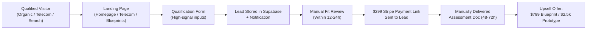
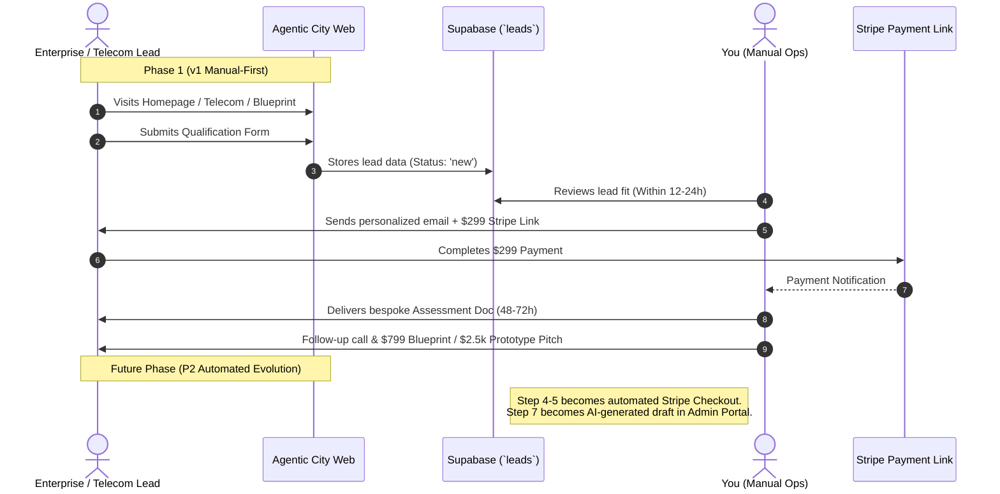

# Agentic City Commercial Funnel — Architecture & Implementation Plan

**Author:** Senior Product Architect & Growth Engineer  
**Date:** September 2026  
**Status:** Ready for Review (Planning Mode — No Code Modified)  
**Deliverable Document:** `docs/commercial-funnel-plan.md`

---

## Executive Summary & Strategic Positioning

This document outlines the transition of **Agentic City** from a boutique portfolio/consultancy website into a high-conversion, revenue-generating commercial funnel.

The long-term platform vision includes automated "Find Your Agent" scoring wizards, dynamic multi-LLM generation, automated branded PDF assessment exports, customer authentication portals, and admin analytics dashboards. **However, this v1 plan deliberately bypasses that heavy engineering overhead.**

The immediate milestone is validating willingness to pay: **securing and manually delivering the first 3–5 paid AI Opportunity Assessments ($299)** with a lean, production-grade, and brand-consistent surface.



---

## A. Current Architecture (Codebase Audit)

An in-depth inspection of the current repository reveals the following stack, routing, components, data layer, and deployment setup:

### 1. Technology Stack & Frameworks
- **Frontend Core:** React 19 (`react@19.0.1`, `react-dom@19.0.1`) with TypeScript (`typescript@~5.8.2`), bundled via Vite 6 (`vite@6.2.3`).
- **Styling & Design System:** Tailwind CSS v4 (`@tailwindcss/vite@4.1.14`) configured in [`src/index.css`](file:///c:/Users/talaa/OneDrive%20-%20Nokia/Cairo/Antigravity/theagenticcity/theagenticcity/src/index.css) utilizing custom `@theme` variables, CSS layers, and utility classes.
- **Motion & 3D:** Framer Motion (`motion@12.23.24`), Three.js (`three@0.185.1`), React Three Fiber (`@react-three/fiber@9.7.0`), React Three Drei (`@react-three/drei@10.7.8`), and GSAP (`gsap@3.15.0`).
- **Document / Export Utilities:** `jspdf@4.2.1` and `html2canvas@1.4.1` currently integrated into the Canvas tool for DOM-to-PDF generation.
- **Analytics & Observability:** PostHog (`posthog-js@1.425.1`) with event helpers in [`src/lib/analytics.ts`](file:///c:/Users/talaa/OneDrive%20-%20Nokia/Cairo/Antigravity/theagenticcity/theagenticcity/src/lib/analytics.ts).
- **Icons & Typography:** Google Material Symbols Outlined, Google Fonts (`Sora` for headlines, `Hanken Grotesk` for body copy, `JetBrains Mono` for terminal/code/labels).

### 2. Routing Structure & Current Pages ([`src/App.tsx`](file:///c:/Users/talaa/OneDrive%20-%20Nokia/Cairo/Antigravity/theagenticcity/theagenticcity/src/App.tsx))
- `/` (`Home.tsx`): 5-chapter scroll-snap layout (Chapter 01 Hero, Chapter 02 Capabilities/Services, Chapter 03 Selected Work, Chapter 04 Method / Two Paths, Chapter 05 The Atrium Contact Form).
- `/work/text2clip` (`Text2Clip.tsx`): Production case study page for natural language video timeline generation.
- `/work/ovi` (`Ovi.tsx`): Case study page for real-time expressive voice agent synthesis.
- `/tools/agent-canvas` (`AgentCanvasTool.tsx`): Interactive A4 landscape Agent & Skills Canvas studio with custom input blocks and client-side PDF export.
- `/insights` (`InsightsIndex.tsx`) & `/insights/:slug` (`InsightDetail.tsx`): MDX-based architectural content hub with 5 published articles and validation scripts.
- `/lab/ideas` (`IdeasLab.tsx`): Community innovation sandbox with idea submissions, filtering, and voting.

### 3. Design System & Tokens ([`src/index.css`](file:///c:/Users/talaa/OneDrive%20-%20Nokia/Cairo/Antigravity/theagenticcity/theagenticcity/src/index.css))
- **Aesthetic:** Warm architectural luxury with ambient glassmorphism and matrix accents (`--color-background: #faf8f5`, `--color-primary: #8c6f2d` antique gold/bronze, `--color-secondary: #2c2a29` obsidian/slate, `--color-tertiary-fixed-dim: #c5a059` sand gold, `--color-glass-border: rgba(197, 160, 89, 0.25)`).
- **Core Visual Primitives:** `.glass-panel` (backdrop blur 20px, light translucent fill, gold border), `.reveal-layer` (scroll-triggered intersection observer transitions), `.animate-float-ring`, `.animate-aura-pulse`, and font utilities (`font-headline-xl`, `font-headline-lg`, `font-headline-md`, `font-body-lg`, `font-body-md`, `font-terminal-sm`, `font-label-caps`).
- **Reusable Drone Component:** [`src/components/AgentDrone.tsx`](file:///c:/Users/talaa/OneDrive%20-%20Nokia/Cairo/Antigravity/theagenticcity/theagenticcity/src/components/AgentDrone.tsx) wandering autonomous agents in the background.

### 4. Backend & Data Layer
- **Express Backend ([`server.ts`](file:///c:/Users/talaa/OneDrive%20-%20Nokia/Cairo/Antigravity/theagenticcity/theagenticcity/server.ts)):** Node/Express server acting as Vite development host and production static file server. Contains:
  - `POST /api/strategy-call`: Captures basic lead info and writes to Airtable (`AIRTABLE_ACCESS_TOKEN`, `AIRTABLE_BASE_ID`).
  - `POST /api/waitlist`: Mock capture endpoint.
- **FastAPI Backend ([`backend/main.py`](file:///c:/Users/talaa/OneDrive%20-%20Nokia/Cairo/Antigravity/theagenticcity/theagenticcity/backend/main.py)):** Standalone Python service with mock waitlist handling.
- **Supabase Integration ([`src/lib/supabase.ts`](file:///c:/Users/talaa/OneDrive%20-%20Nokia/Cairo/Antigravity/theagenticcity/theagenticcity/src/lib/supabase.ts)):** Supabase client initialized via `VITE_SUPABASE_URL` and `VITE_SUPABASE_ANON_KEY`, currently supporting the Ideas Lab via `supabase/migrations/20260904_ideas_lab.sql`.

### 5. Deployment Setup
- Build pipeline configured in `package.json`: validates insights MDX, runs `vite build`, bundles `server.ts` with `esbuild` to `dist/server.cjs`.
- Docker configuration (`deploy/Dockerfile`, `deploy/nginx.conf`) and Cloudflare routing (`wrangler.toml`, `public/_redirects`). Changes go live via Git pushes triggers to container/host deployment.

### 6. Reusable Assets vs. Prior Work Summary
| Asset / Module | Status | Funnel Reusability |
| :--- | :--- | :--- |
| **Design System (`index.css`)** | Production-ready | **100% Reusable** — All new funnel pages must adopt these exact tokens without creating conflicting styles. |
| **Case Study Template (`/work/*`)** | Production-ready | **100% Reusable** — Perfect scaffolding for the 3–5 static blueprint case studies. |
| **Agent & Skills Canvas (`/tools/agent-canvas`)** | Live interactive tool | **High Value Lead Magnet** — Retain as free top-of-funnel value asset linked from blueprints. |
| **Supabase Client (`lib/supabase.ts`)** | Initialized | **100% Reusable** — Ready to host the new `leads` / `assessments` schema without new infrastructure. |
| **MDX Insights Engine** | Active | **Independent** — Leave in place as authority builder; pause further feature work to focus on revenue. |
| **Ideas Lab (`/lab/ideas`)** | Live | **Independent** — Operational; do not expand until commercial funnel is validated. |

---

## B. Gap Analysis (Scoped Exclusively to v1)

To deliver a functioning commercial funnel that converts visitors into paid $299 assessments without introducing unvalidated complexity, the following specific gaps must be addressed:

```
┌─────────────────────────────────────────────────────────────────────────────────┐
│                                 GAP ANALYSIS                                    │
├──────────────────────────┬──────────────────────────────────────────────────────┤
│ 1. Homepage Positioning   │ Current: "We build agents" (generic consultancy).    │
│                          │ Needed: Problem-first value prop + clear entry tier  │
│                          │ ($299 Assessment with 48h turnaround & deliverables) │
├──────────────────────────┼──────────────────────────────────────────────────────┤
│ 2. Telecom Landing Page  │ Current: Missing.                                    │
│                          │ Needed: High-intent B2B vertical page at `/telecom`  │
│                          │ addressing NOC, OSS/BSS, RAN, and incident triage.   │
├──────────────────────────┼──────────────────────────────────────────────────────┤
│ 3. Blueprint Case Studies│ Current: 2 custom pages (`/work/text2clip`, `/ovi`). │
│                          │ Needed: 3-5 static architectural blueprints showing  │
│                          │ problem, agent topology, tech stack, and ROI.        │
├──────────────────────────┼──────────────────────────────────────────────────────┤
│ 4. Qualification Form    │ Current: 3-field contact box (Name, Email, Blurb).  │
│                          │ Needed: High-signal qualification form (Role, Stack, │
│                          │ Automation Target, Timeline, Bottleneck).            │
├──────────────────────────┼──────────────────────────────────────────────────────┤
│ 5. Lead Storage Pipeline │ Current: Airtable API in Express (fragile in SSR/SPA)│
│                          │ Needed: Native Supabase `leads` table with RLS.      │
├──────────────────────────┼──────────────────────────────────────────────────────┤
│ 6. Payment Trigger       │ Current: Free strategy call bookings only.           │
│                          │ Needed: Hosted Stripe Payment Link ($299).           │
├──────────────────────────┼──────────────────────────────────────────────────────┤
│ 7. Assessment Delivery   │ Current: No formalized assessment product structure. │
│                          │ Needed: Markdown/Doc assessment template for manual  │
│                          │ bespoke delivery within 48-72h.                      │
└──────────────────────────┴──────────────────────────────────────────────────────┘
```

---

## C. Recommended Architecture (v1 Scope Only)

The v1 architecture prioritizes zero new external dependencies, maximum reusability of existing design tokens, and a resilient manual-first data flow.

```
┌───────────────────────────────────────────────────────────────────────────────────────┐
│                                 v1 ROUTING & UX FLOW                                  │
│                                                                                       │
│   ┌────────────────────┐     ┌─────────────────────┐     ┌────────────────────────┐   │
│   │   Repositioned     │     │   Telecom Vertical  │     │   Blueprint Library    │   │
│   │   Homepage (`/`)   │     │   Page (`/telecom`) │     │   (`/work/*` or `/bp`) │   │
│   └─────────┬──────────┘     └──────────┬──────────┘     └───────────┬────────────┘   │
│             │                           │                            │                │
│             └─────────────────────┬─────┴────────────────────────────┘                │
│                                   ▼                                                   │
│                      ┌─────────────────────────┐                                      │
│                      │   Qualification Form    │                                      │
│                      │  (Modal / Dedicated ID) │                                      │
│                      └────────────┬────────────┘                                      │
│                                   │                                                   │
│                                   ▼ (Direct Supabase Client or Express POST)          │
│                      ┌─────────────────────────┐                                      │
│                      │   Supabase `leads` DB   │                                      │
│                      └────────────┬────────────┘                                      │
│                                   │                                                   │
│                                   ▼                                                   │
│                      ┌─────────────────────────┐                                      │
│                      │ Manual Review & Email   │                                      │
│                      │ (Stripe Link: $299 USD) │                                      │
│                      └─────────────────────────┘                                      │
└───────────────────────────────────────────────────────────────────────────────────────┘
```

### 1. Frontend & Routing Layer
- **New Routes:**
  - `/telecom`: Targeted landing page for telecom operators, systems integrators, and infrastructure teams.
  - `/blueprints` (or expanding `/work`): Clean catalog linking to 3–5 dedicated static blueprint breakdowns:
    1. *Autonomous NOC & Incident Remediation Agent*
    2. *OSS/BSS Billing & Order Fallout Resolution Agent*
    3. *Enterprise Multi-Agent Customer Concierge & Voice Dispatcher*
    4. *Codebase & Legacy API Migration Orchestrator*
    5. *Executive Research & Competitive Intelligence Swarm*
- **Design System Fidelity:**
  - Use existing `.glass-panel`, `--color-primary` (`#8c6f2d`), `--color-secondary` (`#2c2a29`), and `--color-background` (`#faf8f5`).
  - Strict adherence to `JetBrains Mono` for metadata tags, `Sora` for section titles, and `Hanken Grotesk` for body copy.
  - No new CSS frameworks or competing utility layers.

### 2. Lead Capture & Data Layer (Supabase)
Instead of relying on third-party form builders or fragile Airtable webhooks, submissions will write directly to a dedicated `leads` table in the existing Supabase instance:

```sql
-- Schema Blueprint for Supabase (v1 Lean + Forward-Compatible)
CREATE TABLE IF NOT EXISTS public.leads (
    id UUID PRIMARY KEY DEFAULT gen_random_uuid(),
    created_at TIMESTAMPTZ DEFAULT now() NOT NULL,
    updated_at TIMESTAMPTZ DEFAULT now() NOT NULL,
    
    -- Contact & Company Info
    full_name TEXT NOT NULL,
    work_email TEXT NOT NULL,
    company_name TEXT,
    job_title TEXT,
    industry TEXT DEFAULT 'General', -- e.g. 'Telecom', 'Fintech', 'Enterprise SaaS'
    
    -- Qualification Responses
    primary_workflow TEXT NOT NULL,   -- Description of task/system to agentify
    current_stack TEXT,              -- e.g. 'Python, AWS, OpenAI, SAP'
    team_size TEXT,                  -- '1-10', '11-50', '50-250', '250+'
    timeline TEXT,                   -- 'Immediate (<2 wks)', '1-2 months', 'Exploring'
    estimated_budget TEXT,           -- '<$1k', '$1k-$5k', '$5k-$20k', '$20k+'
    source_page TEXT NOT NULL,       -- 'homepage', 'telecom_landing', 'blueprint_noc'
    
    -- Operational & Funnel Tracking (Pre-allocated for future automation)
    lead_status TEXT DEFAULT 'new' NOT NULL, -- 'new', 'qualified', 'payment_sent', 'paid', 'delivered', 'archived'
    stripe_payment_id TEXT,
    assessment_tier TEXT DEFAULT 'opportunity_assessment_299',
    admin_notes TEXT
);

-- Basic RLS: Public can INSERT, only service role can SELECT/UPDATE
ALTER TABLE public.leads ENABLE ROW LEVEL SECURITY;

CREATE POLICY "Allow public lead insert"
ON public.leads
FOR INSERT
WITH CHECK (true);
```

### 3. Payment Layer (Stripe Payment Links)
- Create a hosted **Stripe Payment Link** for **"AI Opportunity Assessment — $299 USD"**.
- Features enabled in Stripe Dashboard:
  - Collect customer billing address & tax ID (if required).
  - Custom confirmation message: *"Thank you. Your assessment intake has been received. Our team will deliver your bespoke architecture & feasibility document within 48–72 hours."*
  - Redirect to `/assessment/confirmation` (simple brand-aligned thank you page).
- **No Stripe webhook listeners, customer portal logic, or database synchronization code required in v1.**

### 4. What the v1 Architecture Explicitly Avoids Precluding
- The `leads` table schema includes status and tier fields so that an automated webhook handler (`stripe_payment_id`, `lead_status = 'paid'`) can be plugged in seamlessly during P1/P2 without schema migrations.
- The qualification form component will use standardized React state structures so it can be swapped for a multi-step wizard in P2 without changing the backend interface.
- Static blueprint pages will use standard props and layouts that can easily accommodate interactive React Flow architecture canvases later.

---

## D. Product Backlog — Strictly Prioritized

```
┌──────────────────────────────────────────────────────────────────────────────────┐
│                               PRODUCT BACKLOG                                    │
├──────────────────────────────────────────────────────────────────────────────────┤
│ P0: Ship in v1 (Revenue-Critical, Manual-First)                                  │
│   ├── 1. Repositioned Homepage Copy, Hero & Offer Packaging                      │
│   ├── 2. High-Signal Qualification Intake Form                                   │
│   ├── 3. Dedicated Telecom Solutions Landing Page (`/telecom`)                   │
│   ├── 4. 3–5 Static Blueprint Case Study Pages (Reusing `/work` Pattern)         │
│   ├── 5. Stripe Hosted Payment Link ($299 Assessment) + Confirmation Screen      │
│   └── 6. Manual Assessment Delivery Markdown SOP & Template                     │
├──────────────────────────────────────────────────────────────────────────────────┤
│ P1: Post-Validation (After 3–5 Paid Deliveries)                                  │
│   ├── 1. Standardized Intake-to-Assessment Markdown Template                     │
│   ├── 2. Second Stripe Payment Link for $799 Blueprint                           │
│   ├── 3. Automated Email Notification on Lead Capture (Resend / SendGrid / Hook) │
│   └── 4. Internal Supabase Lead Management View (Simple Table/Spreadsheet)       │
├──────────────────────────────────────────────────────────────────────────────────┤
│ P2: Defer Until Sustained Revenue Validates Full Automation                      │
│   ├── 1. Interactive 6-Step "Find Your Agent" Wizard + Scoring Engine           │
│   ├── 2. Automated AI Report Generation & Multi-LLM Provider Abstraction        │
│   ├── 3. Server-Side Branded PDF Report Rendering Engine                         │
│   ├── 4. Full Stripe Webhook Sync, Customer Accounts & Client Portal            │
│   ├── 5. Admin Analytics Dashboard & Conversion Metric Visualizers               │
│   └── 6. Interactive Drag-and-Drop Canvas Diagramming within Blueprints          │
└──────────────────────────────────────────────────────────────────────────────────┘
```

### P0 Detailed Specifications (Scope for Immediate Implementation)

#### Item 1: Repositioned Homepage ([`src/pages/Home.tsx`](file:///c:/Users/talaa/OneDrive%20-%20Nokia/Cairo/Antigravity/theagenticcity/theagenticcity/src/pages/Home.tsx))
- **Hero Repositioning:** Replace high-level consultancy tagline with a clear, outcome-driven proposition: *"Turn complex operational workflows into autonomous AI agent systems. Start with a $299 rapid feasibility & architecture assessment delivered in 48 hours."*
- **Offer Grid:** Clarify the 3-stage commercial progression:
  1. *Stage 1: AI Opportunity Assessment ($299)* — 48h turnaround, workflow map, tech feasibility, risk matrix, ROI estimate.
  2. *Stage 2: Agentic AI Blueprint ($799)* — Full system architecture, tool integration schemas, prompt specifications, execution plan.
  3. *Stage 3: Working Prototype & Production Deployment ($2,500 - $15,000)* — Production-grade multi-agent build with SLAs.
- **CTA Updates:** Replace generic "Book Strategy Call" buttons with high-intent "Request AI Assessment" buttons anchored to the qualification intake.

#### Item 2: High-Signal Qualification Form
- Replace the 3-field text box with a structured qualification module:
  - Full Name, Work Email, Company Name, Role/Job Title.
  - Target Workflow / Problem to Solve (Textarea with prompts: e.g., customer ticket triage, NOC alarm correlation, data scraping).
  - Existing Tech Stack (e.g., Python, Node, Azure, AWS, LangChain, Custom).
  - Urgency & Estimated Budget Range dropdowns.
- Form submits to Supabase `leads` table with instant feedback and reassuring SLA confirmation.

#### Item 3: Telecom Solutions Landing Page (`/telecom`)
- Tailored copy for Telco executives, NOC managers, and Network Operations leads.
- Sections:
  - *Hero:* Autonomous Network Operations & Agentic Telco Infrastructure.
  - *Use Case Matrix:* Real-time Alarm Correlation, Ticket Deduplication, Customer Billing Fallout, Autonomous Field Dispatch.
  - *Compliance & Security:* Air-gapped deployment capability, on-prem LLM orchestration, zero data retention compliance.
  - *Direct CTA:* Request a Telecom Agent Assessment ($299).

#### Item 4: 3–5 Static Blueprint Pages (Reusing `/work` Pattern)
Build 3–5 clean static case studies following the proven layout of [`Ovi.tsx`](file:///c:/Users/talaa/OneDrive%20-%20Nokia/Cairo/Antigravity/theagenticcity/theagenticcity/src/pages/Ovi.tsx) and [`Text2Clip.tsx`](file:///c:/Users/talaa/OneDrive%20-%20Nokia/Cairo/Antigravity/theagenticcity/theagenticcity/src/pages/Text2Clip.tsx):
1. **Telecom NOC Alarm Triaging Agent:** Multi-agent anomaly detection and root-cause correlation for telecom core networks.
2. **Autonomous Order Fallout Resolver:** BSS/OSS integration agent resolving billing exceptions and provisioning failures.
3. **Multi-Agent Video Pipeline (Text2Clip):** Upgrade existing Text2Clip case study with explicit architecture blueprint schemas and ROI metrics.
4. **Real-time Voice Synthesis Agent (OVI):** Upgrade existing OVI case study with conversational agent orchestration patterns.
5. **Enterprise Knowledge Retrieval & Synthesis Swarm:** Hybrid RAG + reasoning swarm for complex internal documentation and compliance.

#### Item 5: Stripe Payment Link & Intake Confirmation
- Configure hosted Stripe Payment Link with clean metadata.
- Build lightweight `/assessment/confirmation` page reassuring the buyer of next steps, delivery timeline (48–72h), and contact email.

#### Item 6: Manual Assessment Delivery SOP & Deliverable Template
- Standardized Markdown/Doc template covering:
  1. *Executive Summary & System Objectives*
  2. *Workflow Decomposition (Tasks suitable for deterministic code vs. LLM agents)*
  3. *Proposed Agent Topology (Orchestrator, Subagents, Tools, Memory)*
  4. *Tech Stack & Model Recommendation (Local/Ollama vs. Claude/OpenAI vs. Gemini)*
  5. *Cost, Latency & Token Budget Projections*
  6. *Risk & Failure Modes (Guardrails, Fallback mechanisms)*
  7. *Next Step: $799 Detailed Blueprint or $2,500 Prototype Scope*

---

## E. 30-Day Execution Plan (P0 Items — Part-Time Solo Capacity)

Designed for realistic part-time execution (approx. 6–10 focused hours per week alongside a full-time role).

```
┌─────────────────────────────────────────────────────────────────────────────────┐
│                           30-DAY EXECUTION TIMELINE                             │
├─────────┬─────────────────────────────────────────────────┬─────────────────────┤
│ Week    │ Focus Area & Deliverables                       │ Estimated Effort    │
├─────────┼─────────────────────────────────────────────────┼─────────────────────┤
│ Week 1  │ Data Layer & High-Signal Qualification Form     │ 6–7 Hours           │
│         │ • Supabase `leads` migration                    │                     │
│         │ • Build reusable `QualificationForm.tsx`        │                     │
│         │ • Form validation & submission testing          │                     │
├─────────┼─────────────────────────────────────────────────┼─────────────────────┤
│ Week 2  │ Homepage Repositioning & Commercial Messaging   │ 6–8 Hours           │
│         │ • Update Hero copy, 3-tier value props          │                     │
│         │ • Replace old Atrium form with new Intake Form  │                     │
│         │ • Setup Stripe $299 Payment Link + Confirm Page │                     │
├─────────┼─────────────────────────────────────────────────┼─────────────────────┤
│ Week 3  │ Telecom Landing Page (`/telecom`)               │ 7–9 Hours           │
│         │ • Compose targeted telco copy                   │ (Flagged: Copy-     │
│         │ • Layout use case matrix & security pillars     │ intensive)          │
│         │ • Connect to qualification form with source tag │                     │
├─────────┼─────────────────────────────────────────────────┼─────────────────────┤
│ Week 4  │ 3–5 Blueprint Case Studies & Delivery Template  │ 8–10 Hours          │
│         │ • Polish 5 static blueprints in `/work/*`       │ (Flagged: Content-  │
│         │ • Finalize Markdown Assessment Deliverable SOP  │ intensive)          │
│         │ • End-to-end dry run (Submit lead → Payment →   │                     │
│         │   Manual Assessment Delivery)                   │                     │
└─────────┴─────────────────────────────────────────────────┴─────────────────────┘
```

> [!WARNING]
> **Capacity Risk Flags:**
> - **Week 3 (Telecom Page Copy) & Week 4 (Blueprint Content):** Writing high-fidelity technical copy and architectural diagrams is the most labor-intensive step. To prevent bottlenecks, reuse existing content structures from `Text2Clip.tsx` and `Ovi.tsx` rather than drafting unique CSS layouts for each case study.

---

## F. Revenue Funnel Mechanics (v1 vs. Future Automation)



### Automation Roadmap:
1. **Manual Today (v1):** Lead review, email outreach with Payment Link, and drafting the assessment deliverable.
2. **First to Automate (P1):** Immediate automated intake confirmation email with the payment link embedded for high-intent self-checkout.
3. **Second to Automate (P2):** AI-assisted first draft generation of the assessment deliverable using the client's submitted stack and problem inputs.

---

## G. Sequencing Note Against In-Flight Initiatives

1. **Revenue Priority:** Commercial Funnel (P0) takes absolute priority over the **Insights Hub** and **Ideas Lab**. No additional features (such as comment systems for Insights or voting mechanics for Ideas Lab) should be scheduled until the $299 assessment funnel is deployed and tested.
2. **Asset Utilization:** Existing assets from Insights (architectural maps) and Ideas Lab (Supabase connection) are leveraged directly into the commercial funnel, ensuring zero wasted effort.

---

## Explicit Clarification Required (Nokia / Telecom Content)

> [!IMPORTANT]
> **Open Question for User Review:**
> **Telecom Case Study IP & Sanitization:**  
> For the Telecom Landing Page (`/telecom`) and the NOC/Alarm Blueprint, please confirm if the use cases should be framed as **generic industry architecture benchmarks** (e.g., *"Tier-1 European Telco Autonomous NOC Orchestration"* or *"Standard 3GPP/OpenRAN Agentic Anomaly Correlation"*) to ensure complete independence from proprietary, confidential, or internal Nokia workflows. All drafted blueprints will use sanitized, vendor-agnostic architecture terms unless instructed otherwise.

---

## Summary of Next Steps

1. **Review & Feedback:** Review this implementation plan (`docs/commercial-funnel-plan.md`).
2. **Approval:** Once approved (or adjusted), we will generate the concrete implementation tasks starting with Week 1 (Supabase `leads` migration and `QualificationForm.tsx`).
3. **Build Execution:** No application code has been modified in this pass. Implementation will begin immediately upon your confirmation.
